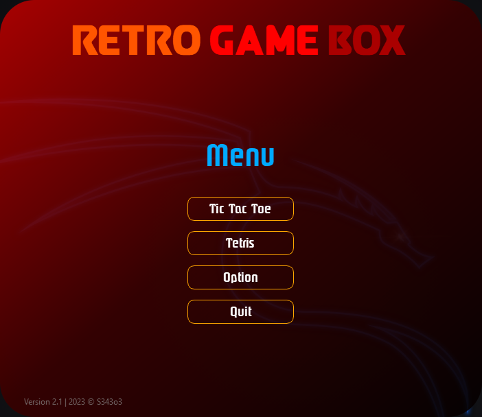
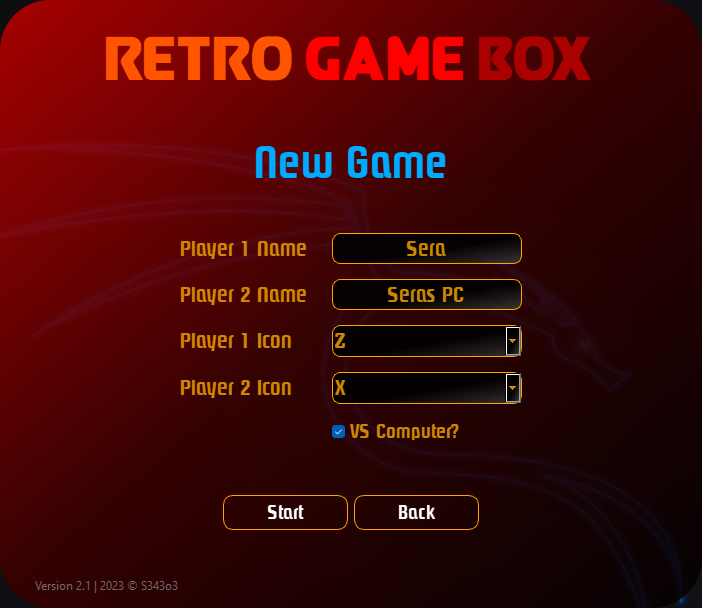
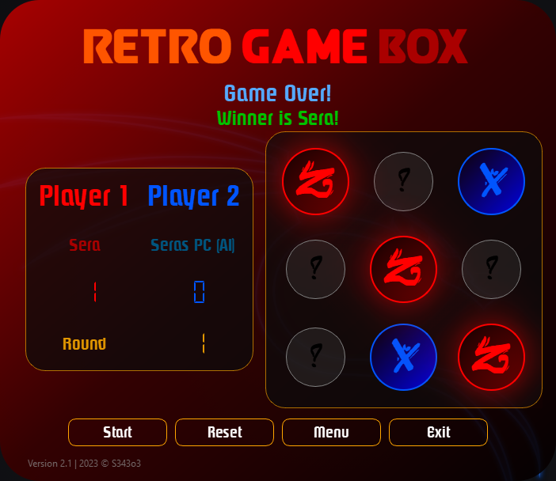
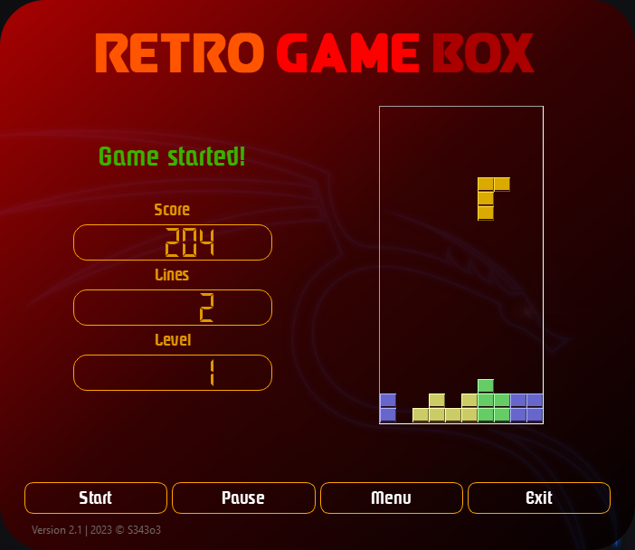

# TicTacToe - Python & PySide6 #

>This is a small TicTacToe-Clone made with PySide6. A nice designed GUI and a AI you can play against.
>To install it just download the last release and extract the ZIP file, after that run the included .exe, enjoy!
>A Tetris Clone can be played too!

## Screenshots ##

> - Some Screenshots from GUI and gameplay.
>
>   - 
>   - 
>   - 
>   - 
